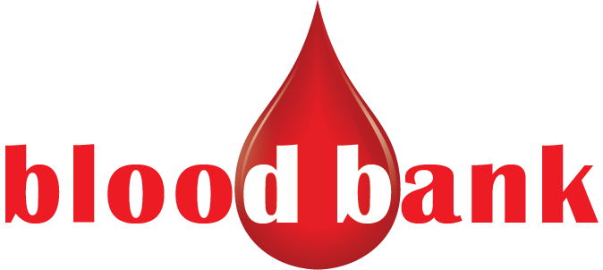

## 1. Introduction:
In this project I have implemented a sample Blood bank application. Where an user can register them as donor. After registering them to app they can member for donor list. He/she is also able to see the other donors who are registered. User can update their profile for availability or on the basis of their loacation. I maintain the database  **GOOGLE FIREBASE**.

## 2. Privacy:
Every user is able to delete his/her account and after that all of his history and data will be removed. If User register again he/she is treated as a new user. Information is not sshared to any other medium, as it has implemented for educational purpose.

## 3. Objectives:
My objective was to build an application  that can continuously provide information about **blood donor ** 

## 4.	Users and Target Areas
*	Blood Bank can use this application.
*	People who need urget **Blood**

## 5. Sample Image:

